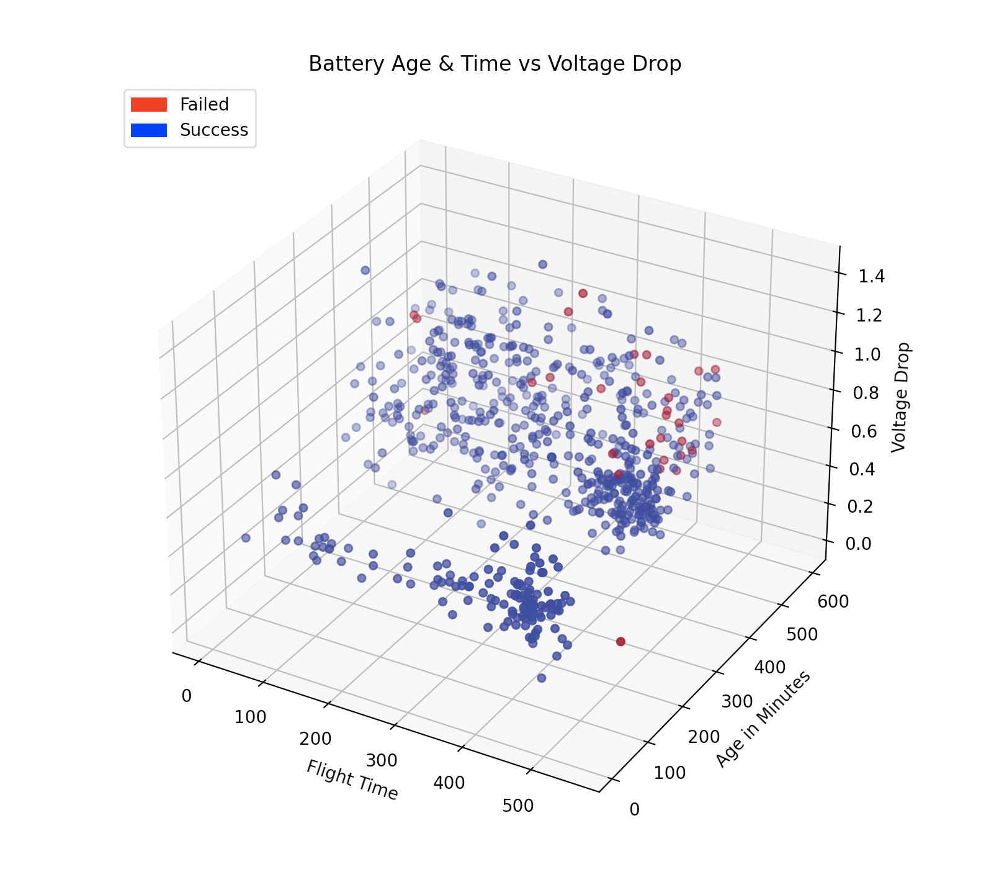
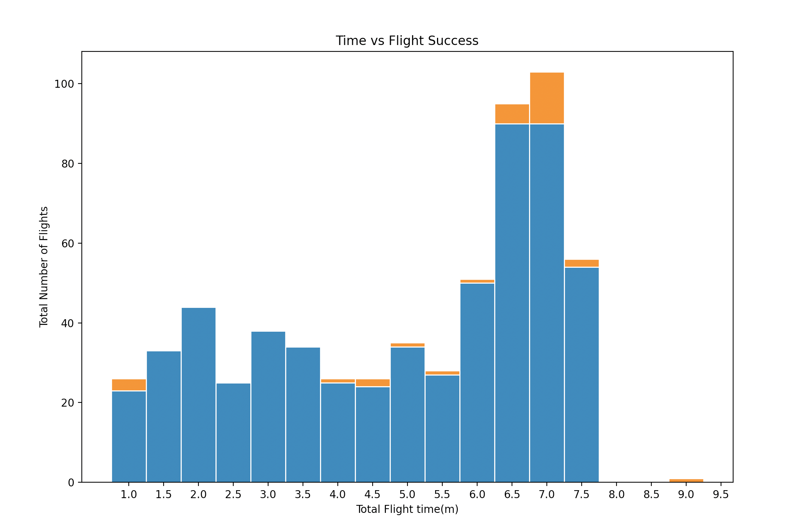
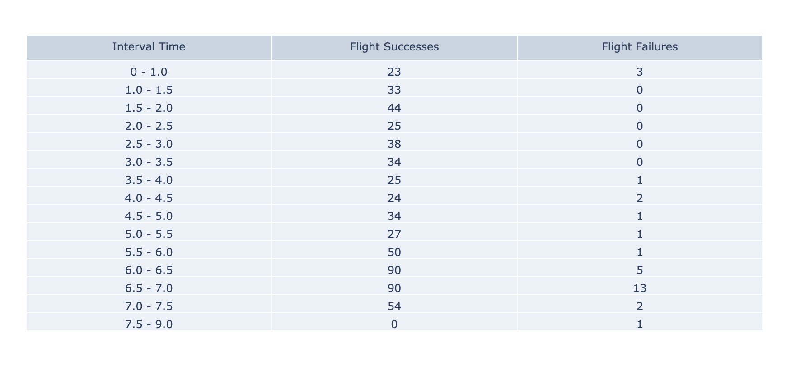
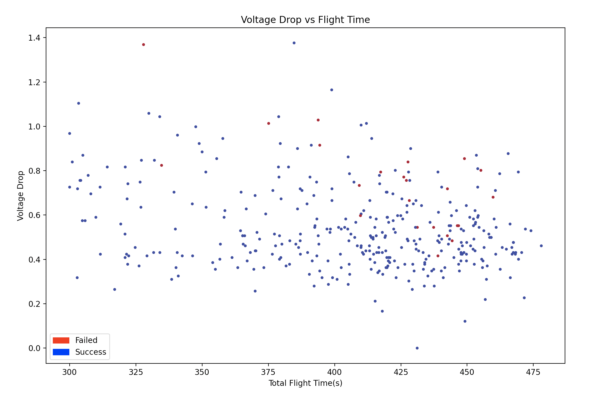
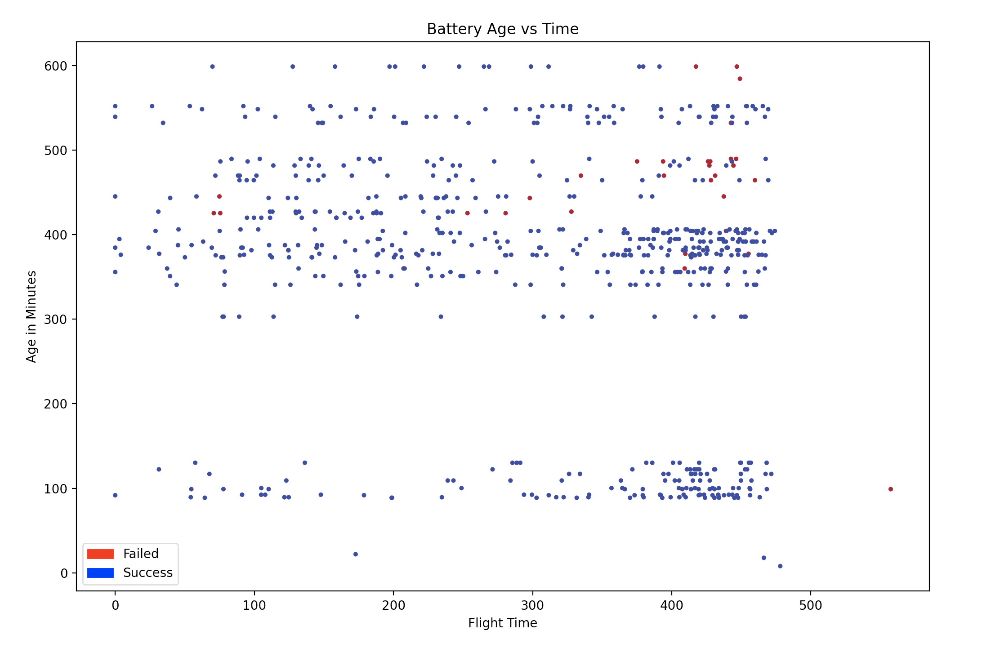

# Drone Flight Data Graphs
Raw Data produced by drone flights converted into various graphs to optimize features such as battery voltage, and battery age resulting in maximizing drone flight success with Python. 

## Table of Contents 
* [About This Project] (#about-this-project)
* [Built With] (#built-with)
* [Setup] (#setup)
* [License] (#license)
* [Contact] (#contact)

## About This Project
After conducting many drone flight tests, the data of what battery was used, battery, temperature, the voltage drop, how long the drone was flying, and weather the drone succeeded or failed was recorded in the Excel sheet titles "Battery Aging." 


<p> 
  Figure 5 plots Battery Age, Battery Voltage Drop, and Total Flight Time to see at what voltage drop, and battery age a drone failed or succeeded. The following    graphs will analyze each factor in detail.
</p>

<p align="center">
  
</p>


<p>
Figure 1 plots failed flights [orange color] vs successful flights [blue color] over 30 second intervals, while the table quantifies this data. 
</p>

Figure 1                |  Table
:-------------------------:|:-------------------------:
  |    

<p>
Figure 2 plots Battery Voltage Drop vs Total Flight Time of the drones to see at what voltage drop and time a drone failed or succeeded. Figure 3 zooms in on the time stamps where the most failed flights occurred.
</p>

  Figure 2                 |  Figure 3
:-------------------------:|:-------------------------:
  |   

<p> 
  Figure 4 plots Battery Age vs the Total Flight Time he drones to see at what voltage drop and time a drone failed or succeeded. 
</p>

<p align="center">
  
</p>


## SetUp
<p>
To use this project, you will need to run it on Python3, so make sure you're system is updated accordingly. 
In addition, you will be needing the following libraries, and
can install them by typing the following commands: 

```
pip install pandas
```
```
pip install numpy
```
```
pip install matplotlib
```
```
pip install plotly
```
</p>

## Built With
Project is Created With: 
* Python 3.8.2
* Pandas
* Numpy
* MatPlotLib
* Plotly

## License
All files and software belong to Vimaan Robotics Inc. 

## Author
Sai Bharathula :/